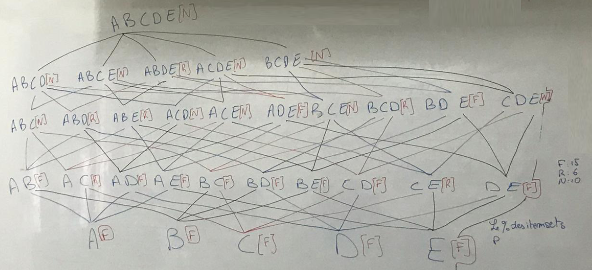
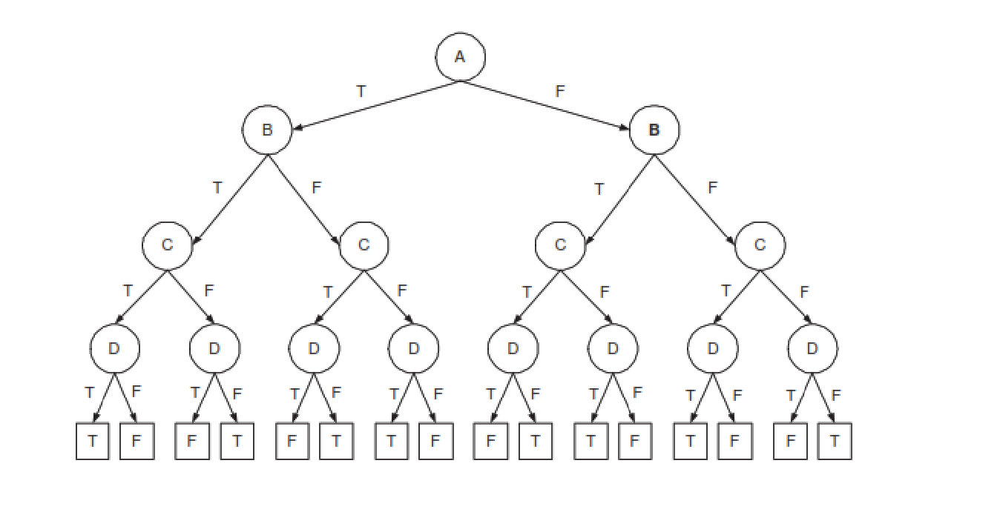

# Data Mining Prearation :

## Content :
### etude de cas 1 :
- Apriori algorithm 
    - extrer les regles d'association
    - extraire les itemsets frequents
    - calculer le support et la confiance et le lift

- Treillis et etiquetage
    - dessiner le treillis
    - etiquetage des noeuds du treillis (non condidat, frequent, non frequent)

- FP-Growth tree
    - extraire les itemsets frequents, supprimer les itemsets non frequents, trier les itemsets frequents decroissant
    - reconstruire la base de donnees a partir de l'etape precedente
    - construire le FP-Growth tree
    - construire la base du modèle conditionnel (chaque noeud est ces parents)
    - supprimer chaque element dans la base du modèle conditionnel avec un support < minsup
    - pour chaque element restant dans la base du modèle conditionnel on construit conditional FP-tree
    - extraire les schémas fréquents

### etude de cas 2 :

- decision tree
    - construire un arbre de decision
    - calculer Gini pour chaque attribut
    - calculer l'entropie pour chaque attribut


-----------------------------------------------------------------------------
-----------------------Cas d'etude 1 : Apriori algorithm---------------------
-----------------------------------------------------------------------------

### 1.1 Apriori algorithm :

voila une base de donnees de transactions :
```
T1 --> 1 3 4
T2 --> 2 3 5
T3 --> 1 2 3 5
T4 --> 2 5
```
- Exercice 1. Appliquer l’algorithme Apriori pour extraire les sous-ensembles d’items fréquents avec minSupp = 2.
```
one itemset | support :
-----------------------
{1}         | 2
{2}         | 3
{3}         | 3
{4}         | 1 // support < minsup donc on supprime
{5}         | 3

two itemset | support :
-----------------------
{1,2}       | 2
{1,3}       | 2
{1,5}       | 1 // support < minsup donc on supprime
{2,3}       | 2
{2,5}       | 3
{3,5}       | 2

three itemset | support :
-------------------------
{1,2,3}       | 1 // support < minsup donc on supprime
{1,2,5}       | 1 // support < minsup donc on supprime
{1,3,5}       | 1 // support < minsup donc on supprime
{2,3,5}       | 2
```
- - Resultat : les sous-ensembles d’items fréquents avec minSupp = 2 : {2} {3} {5} {1,2} {1,3} {2,3} {2,5} {3,5} {2,3,5}

- - Exercice 2. Générer les règles d’association avec minConf = 1

 
conf({1->2}) = support({1,2}) / support({1}) = 2/2 = 1
conf({2->1}) = support({1,2}) / support({2}) = 2/3 = 0.66


conf({1->3}) = support({1,3}) / support({1}) = 2/2 = 1
conf({3->1}) = support({1,3}) / support({3}) = 2/3 = 0.66


conf({2->3}) = support({2,3}) / support({2}) = 2/3 = 0.66
conf({3->2}) = support({2,3}) / support({3}) = 2/3 = 0.66

conf({2->5}) = support({2,5}) / support({2}) = 3/3 = 1
conf({5->2}) = support({2,5}) / support({5}) = 3/3 = 1

conf({3->5}) = support({3,5}) / support({3}) = 2/3 = 0.66
conf({5->3}) = support({3,5}) / support({5}) = 2/3 = 0.66

conf({2,3->5}) = support({2,3,5}) / support({2,3}) = 2/2 = 1
conf({2,5->3}) = support({2,3,5}) / support({2,5}) = 2/3 = 0.66
conf({3,5->2}) = support({2,3,5}) / support({3,5}) = 2/2 = 1

- - Resultat : les regles d’association avec minConf = 1 : {1->2} {1->3} {2->3} {2->5} {3->5} {2,3->5} {2,5->3} {3,5->2}


-----------------------------------------------------------------------------
-----------------------Cas d'etude 1 : Treillis et etiquetage----------------
-----------------------------------------------------------------------------


- Soit l'ensemble d'items I={A,B,C,D,E}. Supposons qu'Apriori soit appliqué sur les données ci-dessous
avec le seuil minsup=30%.


Dessinez le treillis des itemsets. Pour chaque noeud du treillis, joignez lui la lettre suivante, selon le
cas:

- N si le noeud est non candidat // or if its father is rare (infrequent)
- F si le noeud est fréquent
- R si le noeud est infrequent

- - Resultat :





-----------------------------------------------------------------------------
-----------------------Cas d'etude 1 : FP-Growth tree------------------------
-----------------------------------------------------------------------------


- Étant donné un ensemble d'éléments {a ; b; c; d; e; F; g; h} et un ensemble de transactions T selon le
tableau suivant, construisez l'arbre FP et utilisez l'algorithme FP-Growth pour calculer tous les
ensembles d'éléments fréquents pour minSup = 0:1 (c'est-à-dire les transactions qui sont nécessaires
pour qu'un ensemble d'éléments soit fréquent).

```

TID | Items
------------
1   | ag
2   | cg
3   | eg
4   | dg
5   | bdfg
6   | dg
7   | ag
8   | ag
9   | ar
10  | ag
11  | afh
12  | af
13  | ade
14  | bdfg


```


- extraire les itemsets frequents, supprimer les itemsets non frequents, trier les itemsets frequents decroissant


item | frequent 
---------------
g    | 10
a    | 8
d    | 5


- reconstruire la base de donnees a partir de l'etape precedente

- construire le FP-Growth tree
- construire la base du modèle conditionnel (chaque noeud est ces parents)
- supprimer chaque element dans la base du modèle conditionnel avec un support < minsup
- pour chaque element restant dans la base du modèle conditionnel on construit conditional FP-tree
- extraire les schémas fréquents


-----------------------------------------------------------------------------
-----------------------Cas d'etude 2 : decision tree-------------------------
-----------------------------------------------------------------------------

### 2.1 decision tree :

voila une base de donnees de transactions :


```
| A | B | C | D | class |
|---|---|---|---|-------|
| T | T | T | T | T     |
| T | T | T | F | F     |
| T | T | F | T | F     |
| T | T | F | F | T     |
| T | F | T | T | F     |
| T | F | T | F | T     |
| T | F | F | T | T     |
| T | F | F | F | F     |
| F | T | T | T | F     |
| F | T | T | F | T     |
| F | T | T | F | T     |
| F | T | F | T | T     |
| F | T | F | F | F     |
| F | F | T | T | T     |
| F | F | T | F | F     |
| F | F | F | T | F     |
| F | F | F | F | T     |
```


- Exercice 1. Construire un arbre de décision pour cette base de données.




voila une base de donnees de transactions :
```

ID | Gender | Car Type | shirt size | class
-------------------------------------------
1   | M      | Family  | Small      | C0
2   | M      | Sport   | Medium     | C0
3   | M      | Sport   | Medium     | C0
4   | M      | Sport   | Large      | C0
5   | M      | sport   | Extra Large| C0
6   | M      | sport   | Extra Large| C0
7   | F      | sport   | Small      | C0
8   | F      | sport   | small      | C0
9   | F      | sport   | Medium     | C0
10  | F      | Luxury  | Large      | C0
11  | M      | family  | Large      | C1
12  | M      | family  | Extra Large| C1
13  | M      | family  | Medium     | C1
14  | M      | luxury  | Extra Large| C1
15  | f      | luxury  | Small      | C1
16  | f      | luxury  | small      | C1
17  | f      | luxury  | Medium     | C1
18  | f      | luxury  | Medium     | C1
19  | f      | luxury  | Medium     | C1
20  | f      | luxury  | Large      | C1
```


- Calculer l'indice de Gini pour l'ensemble de la collection d'exemples de formation.

Gini(class) = 1 - (10/20)^2 + (10/20)^2 = 0.5

```
| C0 | 10 |
----------
| C1 | 10 |
```

- Calculez l'indice de Gini pour l'attribut Customer ID.

```
| C0 | 1 |
----------
| C1 | 0 |
```
Gini(Customer ID = 1 ) = 1 - (1/1)^2 - (0/1)^2 = 0
Gini(Customer ID = 2 ) = 1 - (0/1)^2 - (1/1)^2 = 0
Gini(Customer ID = 3 ) = 1 - (0/1)^2 - (1/1)^2 = 0
...
Gini(Customer ID = 20 ) = 1 - (0/1)^2 - (1/1)^2 = 0

Gini(Customer ID) = (1/20) * 0 + (1/20) * 0 + (1/20) * 0 + ... + (1/20) * 0 = 0


- Calculer l'indice de Gini pour l'attribut Gender.

#### Gender = M:
```
| C0 | 6 |
----------
| C1 | 4 |
```
Gini(Gender = M) = 1 - (6/10)^2 - (4/10)^2 = 0.48

#### Gender = F:
```
| C0 | 4 |
----------
| C1 | 6 |
```
Gini(Gender=F) = 1 - (4/10)^2 - (6/10)^2 = 0.48


Gini(Gender) = (10/20) * 0.48 + (10/20) * 0.48 = 0.48


- Calculer l'indice de Gini pour l'attribut Type de voiture en utilisant la répartition


#### Car Type = Family:
```
| C0 | 1 |
----------
| C1 | 3 |
```
Gini(Car Type = Family) = 1 - (1/4)^2 - (3/4)^2 = 0.375

#### Car Type = Sport:
```
| C0 | 8 |
----------
| C1 | 0 |
```
Gini(Car Type = Sport) = 1 - (8/8)^2 - (0/8)^2 = 0

#### Car Type = Luxury:
```
| C0 | 1 |
----------
| C1 | 7 |
```
Gini(Car Type = Luxury) = 1 - (1/8)^2 - (7/8)^2 = 0.218


Gini(Car Type) = (4/20) * 0.375 + (8/20) * 0 + (8/20) * 0.218 = 0.162


-  Calculez l'indice de Gini pour l'attribut Taille de chemise

#### shirt size = Small:
```
| C0 | 3 |
----------
| C1 | 2 |
```
Gini(shirt size = Small) = 1 - (3/5)^2 - (2/5)^2 = 0.48

#### shirt size = Medium:
```
| C0 | 3 |
----------
| C1 | 4 |
```
Gini(shirt size = Medium) = 1 - (3/7)^2 - (4/7)^2 = 0.489

#### shirt size = Large:
```
| C0 | 2 |
----------
| C1 | 2 |
```
Gini(shirt size = Large) = 1 - (2/4)^2 - (2/4)^2 = 0.5

#### shirt size = Extra Large:
```
| C0 | 2 |
----------
| C1 | 2 |
```
Gini(shirt size = Extra Large) = 1 - (2/4)^2 - (2/4)^2 = 0.5


Gini(shirt size) = (5/20) * 0.48 + (7/20) * 0.489 + (4/20) * 0.5 + (4/20) * 0.5 = 0.493


------------------------------------------------------------------------------------------


 


Taux d'erreur (gender = Male)  : 
Geni (gender Male) = 1 - (6/10)^2 - (4/10)^2 = 0.48

```
1 - Max (6/10 , 4/10)
=> 1 - 6/10   
```
-------------------------

Taux d'erreur (gender = Female)  : 
Geni (gender Female) = 1 - (4/10)^2 - (6/10)^2 = 0.48

```
1 - Max (4/10 , 6/10)
=> 1 - 6/10
```

```
 _______________________________________________________________________________
|                                                                               |
|    Taux d'erreur (gender)  : (TEM x N°m) / Total    +    (TEF x N°f) / Total  |
|_______________________________________________________________________________|

```


