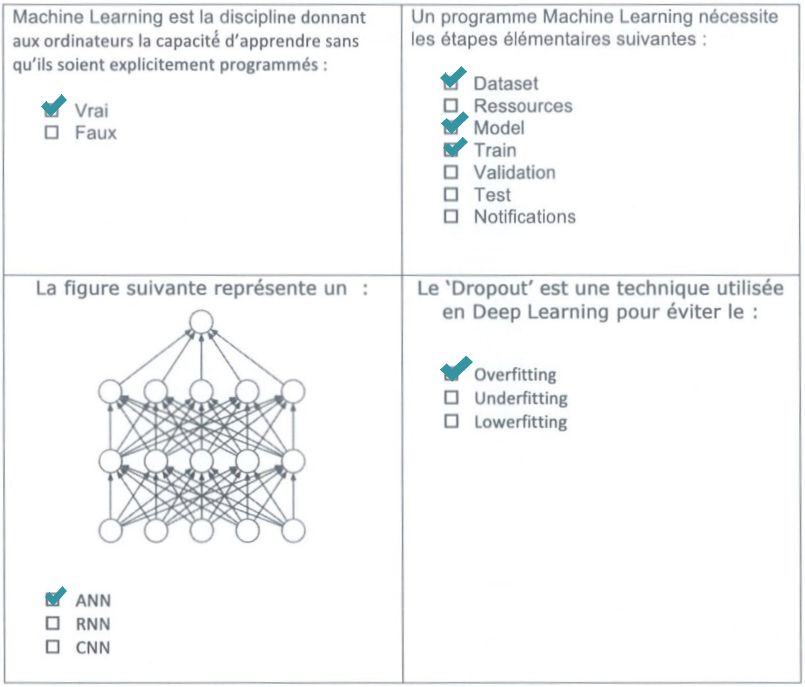
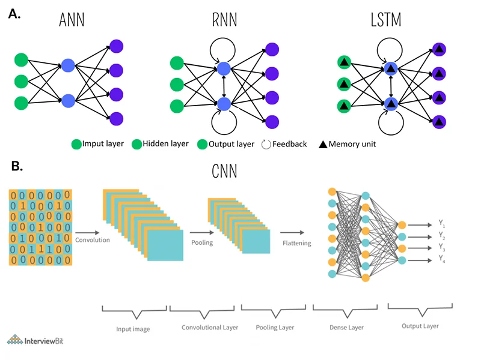

# Exam correction :

## Exercice 1 : QCM



------------------------------------------------------------

### help and references :




- overfitting : is a modeling error that occurs when a function is too closely fit to a limited set of data points. in order to avoid overfitting, we can use regularization techniques such as L1 and L2 regularization, dropout, and early stopping.


- underfitting : is a modeling error that occurs when a function is too simple to fit the underlying structure of the data. in order to avoid underfitting, we can use more complex models, more features, and more training data.


------------------------------------------------------------


## Exercice 2 : Code Analysis


- code1 : 
  ```python

  model.fit(X_train, y_train, epochs=100, batch_size=64)
  predicted_stock_price = model.predict(X_test)

  ```

  - the first line of code is used to train the model on the training data. the model is trained for 100 epochs with a batch size of 64, that means the model will be trained for 100 iterations and each iteration will use 64 samples from the training data to update the model's accuracy.

- code2 : 
  ```python

  plt.plot(real_stock_price, color = 'red', label = 'Real Tata Stock Price')
  plt.plot(predicted_stock_price, color = 'green', label = 'Predicted Tata Stock Price')

  plt.title('Tata Stock Price Prediction')
  plt.xlabel('Time')
  plt.ylabel('Tata Stock Price')
  plt.legend()
  plt.show()

  ```

  - the second block of code is used to plot the real stock price and the predicted stock price. the real stock price is plotted in red and the predicted stock price is plotted in green. the title of the plot is "Tata Stock Price Prediction" and the x-axis label is "Time" and the y-axis label is "Tata Stock Price". the plot also contains a legend that shows the real stock price and the predicted stock price.
  basacly, this code is used to visualize the predicted stock price and compare it with the real stock price.


- code3 : 
  ```python

  url = 'https://raw.githubusercontent.com/mwitiderrick/stockprice/master/NSE-TATAGLOBAL.csv'
  dataset_train = pd.read_csv(url)
  training_set = dataset_train.iloc[:, 1:2].values
  sc = MinMaxScaler(feature_range = (0, 1))
  training_set_scaled = sc.fit_transform(training_set)

  ```

  - the third block of code is used to load the dataset from a URL and preprocess the data. the dataset is loaded from the URL 'https://raw.githubusercontent.com/mwitiderrick/stockprice/master/NSE-TATAGLOBAL.csv' and stored in the variable 'dataset_train'. the training data is extracted from the dataset and stored in the variable 'training_set'. the data is then scaled using the MinMaxScaler and stored in the variable 'training_set_scaled'.

- code4 : 
  ```python
  model = Sequential()
  model.add(LSTM(units = 50, return_sequences = True, input_shape = (X_train.shape[1], 1)))
  model.add(Dropout(0.2))
  model.add(LSTM(units = 50, return_sequences = True))
  model.add(Dropout(0.2))
  model.add(LSTM(units = 50, return_sequences = True))
  model.add(Dropout(0.2))
  model.add(LSTM(units = 50))
  model.add(Dropout(0.2))
  model.add(Dense(units = 1))
  model.compile(optimizer = 'adam', loss = 'mean_squared_error')
  ```

  - the fourth block of code is used to create a Long Short-Term Memory (LSTM) model. the model is created using the Sequential class and consists of four LSTM layers with 50 units each. each LSTM layer is followed by a Dropout layer with a dropout rate of 0.2. the model also contains a Dense layer with one unit. the model is compiled using the 'adam' optimizer and the mean squared error loss function.
  basacly, this code is used to create a LSTM model using adam optimizer.


------------------------------------------------------------

## Exercice 3 : Problem Solving

```
AI trading technologies peut désormais identifier des modèles de trading complexes à grande échelle sur plusieurs marchés en temps réel combinant la technologie d'apprentissage automatique avec une puissance de traitement de données massive à grande vitesse

votre mission consiste à concevoir et réaliser une application multiplateforme nommée AI TRADING APP permettant de la prédiction en temps réel du cours de l'action d'une entreprise bien déterminée

  1- quel paradigme de programmation va-t-on utiliser classique ou machine learning ?justifier votre réponse

  2- quel langage architecture ou bibliothèque va-t-on utiliser ? justifier votre réponse

  3- discuter le dataset qu'on doit utiliser
  
  4- proposer un modèle d'apprentissage

  5- proposer un code pour cette application

```	

### Answers :

1- on va utiliser le paradigme de programmation machine learning, car on veut prédire le cours de l'action d'une entreprise en temps réel en utilisant la technologie d'apprentissage automatique.


2- on va utiliser le langage de programmation Python, car il est largement utilisé dans le domaine de l'apprentissage automatique et dispose de nombreuses bibliothèques et frameworks pour le traitement des données et la création de modèles d'apprentissage automatique. on va utiliser la bibliothèque TensorFlow pour la création du modèle d'apprentissage automatique.


3- le dataset doit contenir des données historiques sur le cours de l'action de l'entreprise bien déterminée. les données doivent inclure des informations telles que le prix d'ouverture, le prix de clôture, le prix le plus bas, le prix le plus élevé, le volume des transactions, etc.


4- on peut proposer un modèle d'apprentissage automatique basé sur les réseaux de neurones récurrents (RNN) pour prédire le cours de l'action en temps réel. le modèle peut être entraîné sur les données historiques pour apprendre les modèles de trading complexes et prédire le cours de l'action en fonction des données en temps réel.


5- le code pour cette application peut être le suivant :

```python

import tensorflow as tf
import numpy as np
import pandas as pd
from sklearn.preprocessing import MinMaxScaler
from tensorflow.keras.models import Sequential
from tensorflow.keras.layers import LSTM, Dropout, Dense

# load the dataset
url = 'https://raw.githubusercontent.com/mwitiderrick/stockprice/master/NSE-TATAGLOBAL.csv'
dataset_train = pd.read_csv(url)
training_set = dataset_train.iloc[:, 1:2].values

# preprocess the data
sc = MinMaxScaler(feature_range = (0, 1))
training_set_scaled = sc.fit_transform(training_set)

# create the training data
X_train = []
y_train = []
for i in range(60, len(training_set_scaled)):
    X_train.append(training_set_scaled[i-60:i, 0])
    y_train.append(training_set_scaled[i, 0])

X_train, y_train = np.array(X_train), np.array(y_train)

# reshape the data
X_train = np.reshape(X_train, (X_train.shape[0], X_train.shape[1], 1))

# create the LSTM model
model = Sequential()
model.add(LSTM(units = 50, return_sequences = True, input_shape = (X_train.shape[1], 1)))
model.add(Dropout(0.2))
model.add(LSTM(units = 50, return_sequences = True))
model.add(Dropout(0.2))
model.add(LSTM(units = 50, return_sequences = True))
model.add(Dropout(0.2))
model.add(LSTM(units = 50))
model.add(Dropout(0.2))
model.add(Dense(units = 1))
model.compile(optimizer = 'adam', loss = 'mean_squared_error')

# train the model
model.fit(X_train, y_train, epochs=100, batch_size=64)

# predict the stock price
predicted_stock_price = model.predict(X_train)

# plot the stock price
import matplotlib.pyplot as plt
plt.plot(training_set, color = 'red', label = 'Real Tata Stock Price')
plt.plot(predicted_stock_price, color = 'green', label = 'Predicted Tata Stock Price')
plt.title('Tata Stock Price Prediction')
plt.xlabel('Time')

plt.ylabel('Tata Stock Price')
plt.legend()
plt.show()

```


------------------------------------------------------------
# --- End of the path ---------- بومساح التمساح ---

