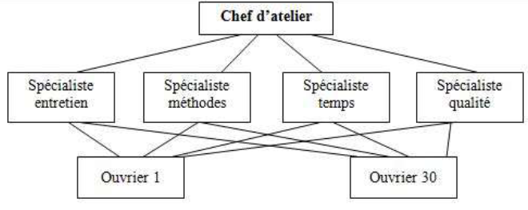
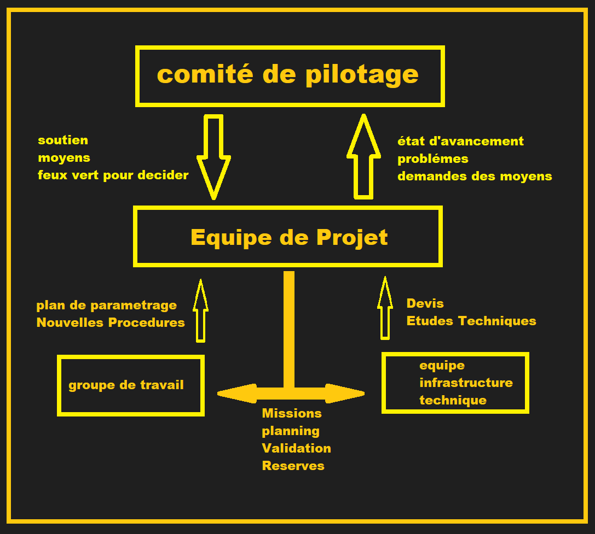

# ERP Exam prep:

# L'entreprise :

## Approche Traditionnelle:
- Distriubteur de richesse
      - Etat : Impots et taxes
      - Salariés : Salaire
      - Actionnaires : Dividendes
      - Preteurs (Banques): Interets
      - L'entreprise : Revenu non distribué
      - organisation sociale : cotisations sociales

- Producteur ddes biens et services
      - travail : salariés / employés / main d'oeuvre
      - capital technique fixe : machines / outils / batiments
      - capital technique circulant : matières premières / énergie / fournitures 

## Approche systémique:
- Composantes:
    - structuraux : Humains / Matériels 

    - fonctionnels : Flux d'energie / Flux d'information


----------------------------------------------------------------------------

# Carastéristiques de l'entreprise:

## L'entreprise est un système organisé:
- Organes:
    - Permanent : Directeur / Chefs
    - Non permanent : Comité d'etude d'information
    - Réglemntaire : Conseil d'administration

- Liaisons:
    - Héarchique : l'autorité d'une personne sur la totalité des Activités d'une autre.
    - Fonctionnelle : L'autorité d'une personne sur une partie (domine de l'activité) d'une autre.
    - Conseil : prendre l'avis d'une personne (spécialiste) pour prendre une décision.

## L'entreprise est un système ouvert:
- Flux d'entrée:
    - Flux de matières premières
    - Flux d'énergie
    - Flux d'information
    - Flux de main d'oeuvre
    - Flux de capitaux

- Flux de sortie:
    - produits / services


## L'entreprise est un système finalisé:
- Caractere: 
    - personnel : prestige / pouvoir / profit / sécurité 
    - institutionnel : 
        - Economique : profit / croissance / rentabilité / developper l'entreprise
        - Social : satisfaction des employés / améliorer les conditions de travail
        - Sociétal : respect de l'environnement / intégration dans la société


----------------------------------------------------------------------------

# La classification des entreprises:

## Classification selon la forme juridique:

- ex : SA / SARL / EURL / SAS / SNC / SCS / GIE / EI / EIRL /

## Classification selon la dimension:

- ex : TPE / PME / ETI / GE

## Classification economique:

- type d'operation:
    - entreprise de production
    - entreprise de distribution
    - entreprise de service

- branches :
   - est une specification de l'activité de l'entreprise

- secteurs :
    - primaire : agriculture / peche / exploitation forestiere / exploitation miniere
    - secondaire : industrie / construction
    - tertiaire : commerce / transport / communication / services
    - quaternaire : recherche / developpement / informatique / finance / assurance


----------------------------------------------------------------------------

# Les Structures de l'entreprise:

- Structure hiérarchique:
- Structure fonctionnelle
- Structure hearchico-fonctionnelle
- Structure divisionnelle
- Structure matricielle


## Structure hiérarchique:

- Unité de commandement:
    - Chaque salarié ne doit avoir qu'un seul supérieur hiérarchique 
        - ctd :(linge d'autorité directe suit une ligne droite)
- delegation de pouvoir:
    - Le supérieur hiérarchique délègue une partie de ses pouvoirs à ses subordonnés 
        - ctd :(meme si il reste responsable de ses actes)
- Responsabilité Absolue:
    - l'obligation du subordonné de rendre compte de ses actes à son supérieur hiérarchique, expliquer ses décisions et justifier ses résultats
        - ctd :(le responsable n'intervient pas dans l'execution des taches)


## Structure fonctionnelle:
- Absence d'unité de commandement:
    - Chaque salarié peut avoir plusieurs supérieurs hiérarchiques
        - ctd :(l'intervansion du responsable est limitée a son domaine de compétence)

- delegation de pouvoir:
    - Lattribuer a un responsable l'autorité nécessaire pour prendre des décisions dans son domaine de compétence
        - ctd :( le domaine d'intervention est bien défini)




## Structure hearchico-fonctionnelle:

- Unité de commandement:
    - le pouvoir appartient a des chefs hearchiques et qui disposent d'une autorité generale (opperationnelle)
        - ctd :( les responsable en line doivent tenir compte des suggestions des responsables en staff et les transformer en ordres)

- Specialisation:
    - les responsables conseil mais ne prennent pas de décisions
        - ctd :( l'etat major ne peut pas prendre de décisions et des ordres direct aux subordonnés)


## Structure divisionnelle (structure en M):

- Decopage par division:
    - par type de produit
    - par zone geographique

- la direction generale:
    - fixe les objectifs
    - controle les resultats
    - coordonne les activités des divisions

- chaque division:
    - est autonome et dispose de sa propre direction


## Structure matricielle:

- Decopage par :
    - activité
    - zone geographique
    - fonction

- structure matricielle combinée:
    - structure fonctionnelle
    - structure divisionnelle


----------------------------------------------------------------------------

# systeme d'information de l'entreprise:

- un systeme d'information est un ensemble de ressources humaines, materielles, logicielles, documentaires et financieres qui permettent de collecter, stocker, traiter et communiquer des informations dans l'entreprise.


# Le cycle de vie de l'entreprise:

- La création
- La croissance:
- La maturité:
- Le déclin:
- Crise:


# Le cycle de changement de l'entreprise:

- Décristallisation 'Unfreeze' (départ de l'ancien dirigeant)
- Déplacement 'change' (Arrivée du nouveau dirigeant)
- Recristallisation 'Refreeze' (mise en place de la nouvelle organisation)


----------------------------------------------------------------------------

# ERP:

- Consultant technique:
    - Installation
    - Parametrage
    - Developpement
    - Maintenance
    - Integration
    - Optimisation

- Consultant fonctionnel:

    - Redaction du cahier des charges
    - Validation des Recettes
    - Realisation des tests
    - Mise en production

----------------------------------------------------------------------------


- Processus:
    - Un processus est un ensemble d'activités qui transforme des éléments d'entrée en éléments de sortie.


- Activité:
    - Une activité est un ensemble de taches réalisées dans le cadre d'un processus.


- Tache:
    - Une tache est un ensemble d'act réalisées par une personne dans le cadre d'une activité.


    


- Caractéristique d'un processus:
    - Ajout de la valeur aux biens et services.
    - possede un début et une fin.
    - represente une vue dynamique de l'entreprise.

- Types de processus:
    - Processus de réalisation:
        - processus de production de biens et services
    - Processus de support:
        - processus de gestion des ressources de l'entreprise (contribue au bon fonctionnement des processus de réalisation)
    - Processus de direction:
        - processus de pilotage de l'entreprise 
            - la stratégie
            - les objectifs
            - la qualité


- workflow:
    - Automatisation d'un processus, en tout ou en partie, au cours duquel des documents informations ou tâches électroniques sont passés d'un participant à un autre pour action, selon un ensemble de règles de procédure

        


# ERP : dimensions fondamentales

- Couverture Opérationnelle (CO) : Cela concerne la capacité de l'ERP à englober tous les processus de l'entreprise dans chaque domaine qui la compose.

- Degré d'intégration (DI) : Il s'agit de la capacité de l'ERP à fournir à tous les acteurs de l'entreprise une vue unique, complète, cohérente et homogène de toutes les informations nécessaires à l'exercice de leurs fonctions. 

----------------------------------------------------------------------------

# ERP : 
- Un ERP est un progiciel de gestion intégré qui permet de gérer l'ensemble des processus opérationnels d'une entreprise.
    - RH  
    - Comptabilité
    - Finance

```
MRP(Material Requirement Planning) :
- calcul des besoins en matières premières

MRP2 (Manufacturing Resource Planning) :
- planification de la production
- gestion des stocks
- gestion des achats
- gestion des RH


SCM (Supply Chain Management) :
- gestion de la relation fournisseur
- gestion de stock
- gestion de transport
- gestion de production


SRM (Supplier Relationship Management) :
- gestion des contrats fournisseurs
- gestion des appels d'offres
- gestion de collaboration avec les fournisseurs


CRM (Customer Relationship Management) :
- gestion des clients
- gestion des services clients

ERP (Enterprise Resource Planning) :
- gestion des ressources de l'entreprise
- gestion des processus de l'entreprise
- gestion des flux d'information
- gestion des flux financiers
- gestion des flux de production
- gestion des flux de distribution
- gestion des flux de vente
- gestion des flux d'achat
- gestion des flux de comptabilité

APS (Advanced Planning and Scheduling) :
- planification avancée de la production
- optimisation des horaires de production
- gestion des contraintes de production

```


----------------------------------------------------------------------------


- Processus métier achat:
    1. Analyse 
    2. Sourcing
    3. Fournisseur
    4. Contrat
    5. Achats
    6. Paiement


- PR (Purchase Request) : Demande d'achat
  - document pour demander l'achat d'un produit ou d'un service

- PO (Purchase Order) : Bon de commande
  - un contrat entre l'acheteur et le vendeur pour livrer des produits ou des services basés sur des conditions spécifiées

- GR (Goods Receipt) : Bon de réception
  - document qui confirme la livraison d'un produit ou d'un service

- VP (Vendor Payment) : Paiement du fournisseur
  - document qui confirme le paiement d'un produit ou d'un service aka facture

----------------------------------------------------------------------------

# Phases d'un projet ERP:

- Phase 1 : Initialisation
    1. Role de l'equipe :

     
    
    2. Contraintes :
        - Budget
        - Deadline
        - Ressources
      

- Phase 2 : Choix du progiciel
  -  Grille d'évaluation des progiciels :
        - un outil d'analyse et de comparaison des progiciels
- Phase 3 : Integration du progiciel
      - Réunions de recuil des besoins :
              - Expression Libre :
                  - les utilisateurs expriment leurs besoins en toute liberté
              - Expression Dirigée :
                  - les utilisateurs expriment leurs besoins en fonction des fonctionnalités du progiciel

- Phase 4 : Exploitation et maintenance.
      -  Cahier des charges :
                - Niveau Synthétique : pour les décideurs
                - Niveau Détaillé : pour les utilisateurs (annexes specifiques)


----------------------------------------------------------------------------


# TCO (Total Cost of Ownership) : Cout total de possession

tco = cout direct + cout indirect + cout caché

- Cout direct :
    - Licences
    - Materiel
    - Maintenance

- Cout indirect :
    - Etude Prealable
    - Formation du personnel
    - Accompagnement des utilisateurs

- Cout caché :
    - Gestions des personnels
    - conseil assistance


----------------------------------------------------------------------------


# Méthodes de conduite de projet:
 1. Markus and Tanis
    - phase 1 : Projet chartering 
       ```
        la définition du projet
        le choix du fournisseur
        l'identification du chef de projet
        l'établissement du planning et du budge
       ```
    - phase 2 : The project
        ```
        la mise en application de l'ERP avec plusieurs modules
        la configuration
        les tests
        la mise en production
       ```
    - phase 3 : The shakedown
        ```
        la prise en main par les utilisateurs
        la résolution des problèmes
        la formation des utilisateurs 
       ```
    - phase 4 : The onward and upward
        ```
        l'amélioration de l'ERP
        une formation plus poussée
        une mise à niveau
       ```


2. Bankroft

- phase 1 : Focus
       ```
         définir les éléments clés pour le comité
         sélection des membres des équipes
         élaboration des directives principales du projet
         création du plan proje
       ```
- phase 2 : As Is
         ```
         Analyse des processus métier actuels
         installation de l’ERP
         mapping et adaptation des processus métier à l’ERP
         formation des équipes du projet.
       ```

- phase 3 : To Be
       ```
         Conception de haut niveau conception détaillée acceptée par
         l'utilisateur
         prototypage interactif
         communication constante avec l'utilisateur
       ```
- phase 4 : Constructive – testing phase
       ```
         Développement d’une configuration globale
         population d'instances de test avec des données réelles construction et test des interfaces
         création et test des rapports
         test du système et des utilisateurs
       ```
- phase 5 : Actual implementation
       ```
         Construction et aménagement du réseau informatique
         installation des postes utilisateurs 
         gestion des formations des utilisateurs et du support
       ```


----------------------------------------------------------------------------

# EDI (échange de données informatisé) :

- Un système qui permet l'échange électronique de données et de documents standardisés entre entreprises ( plus
utilisé pour les transactions commerciales comme les commandes, les factures et les avis d'expédition.)


# EAI (Enterprise Application Integration) :

- processus de connexion et d'intégration de diverses applications et systèmes d'entreprise pour permettre un flux de données et une communication fluides.
