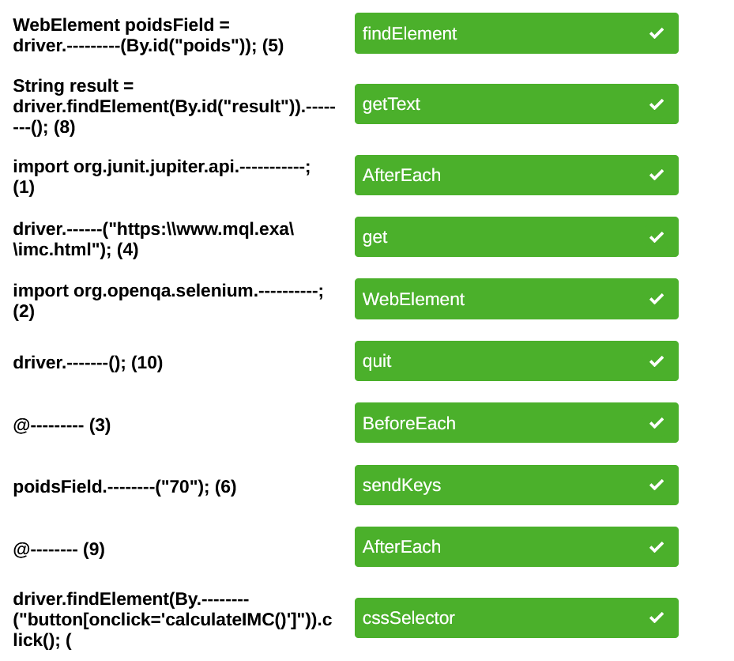

# Genie logiciel prep:


### Caractéristiques de la qualité logicielle:

```

– la validité : aptitude d'un logiciel à réaliser exactement les tâches définies par sa spécification,

– la fiabilité : aptitude d'un logiciel à assurer de manière continue le service attendu,

– la robustesse : aptitude d'un logiciel à fonctionner même dans des conditions anormales,

– l’extensibilité : facilité d'adaptation d'un logiciel aux changements de spécification,

– la réutilisabilité : aptitude d'un logiciel à être réutilisé en tout ou partie

– la compatibilité : aptitude des logiciels à pouvoir être combinés les uns aux autres.

– l’efficience : aptitude d'un logiciel à bien utiliser les ressources matérielles
telles la mémoire, la puissance de l’U.C., etc.

– la portabilité : facilité à être porté sur de nouveaux environnements matériels et/ou logiciels,

– la traçabilité : capacité à identifier et/ou suivre un élément du cahier des charges lié à un
composant d'un logiciel.

– la vérifiabilité : facilité de préparation des procédures de recette et de certification,

– l’intégrité : aptitude d'un logiciel à protéger ses différents composants conte des accès ou des
modifications non autorisés,

– la facilité d'utilisation, d’entretien, etc.


```

### Les Normes de qualité logicielle:


- norme ISO/IEC 25010:2011 : Aider les organisations à définir, évaluer et gérer la qualité des logiciels tout au long de leur cycle de vie.

- l'ISO/IEC 25010:2011 : définit huit caractéristiques de qualité logicielle et leurs sous-caractéristiques associées. (validité, fiabilité, efficience, maintenabilité, portabilité, sécurité, compatibilité, utilisabilité )

- Modèle de qualité d'utilisation : composé de cinq caractéristiques
    

- Modèle de qualité de produit : composé de huit caractéristiques
    
    - Fonctionnalité : Cette caractéristique concerne la capacité du logiciel à fournir les fonctionnalités requises, y compris sa pertinence, son exactitude, sa complétude et sa conformité aux spécifications fonctionnelles.
    
    - Fiabilité : Il s'agit de la capacité du logiciel à maintenir ses performances au fil du temps, en évitant les défaillances et les erreurs.

    - Utilisabilité : Cette caractéristique concerne l'ergonomie et la convivialité du logiciel, y compris la facilité d'apprentissage, l'efficacité d'utilisation et la satisfaction de l'utilisateur.
    
    - Efficacité opérationnelle : Il s'agit de la capacité du logiciel à fonctionner de manière efficiente, en utilisant de manière optimale les ressources disponibles.
    
    - Compatibilité : Cette caractéristique se réfère à la capacité du logiciel à fonctionner avec d'autres systèmes ou composants sans conflits.
    
    - Sécurité : Il s'agit de la capacité du logiciel à protéger les données et les fonctionnalités contre les accès non autorisés, les dommages ou les perturbations.
    
    - Maintenabilité : Cette caractéristique concerne la facilité avec laquelle le logiciel peut être modifié, mis à jour ou réparé.

    - Portabilité : Il s'agit de la capacité du logiciel à être utilisé dans différents environnements ou plates-formes.


### les principe SOLID:


S: Single Responsability Principle: chaque classe doit avoir une seule responsabilité, et cette responsabilité doit être complètement encapsulée par la classe. Toutes ses services doivent être étroitement alignés avec cette responsabilité.

O: Open-Closed Principle: les entités logicielles (classes, modules, fonctions, etc.) doivent être ouvertes pour l'extension, mais fermées pour la modification. "Ouvert pour l'extension" signifie que nous devons pouvoir ajouter de nouvelles fonctionnalités ou composants au logiciel sans modifier son code source. "Fermé pour la modification" signifie que les entités existantes du code source ne doivent pas être modifiées, sauf pour éliminer les bugs.

L: Liskov Substitution Principle: les objets de votre programme doivent être remplaçables par des instances de leurs sous-types sans altérer la cohérence du programme. Plus simplement, si S est un sous-type de T, alors les objets de type T peuvent être remplacés par des objets de type S sans altérer les propriétés souhaitables du programme (exactitude, tâche effectuée, etc.).


I: Interface Segregation Principle: les clients ne doivent pas être forcés de dépendre d'interfaces qu'ils n'utilisent pas. En d'autres termes, les interfaces volumineuses doivent être divisées en plus petites afin que les clients qui n'utilisent pas une interface complète ne soient pas obligés de la mettre en œuvre.


D: Dependency Inversion Principle: les modules de haut niveau ne doivent pas dépendre de modules de bas niveau. Les deux doivent dépendre d'abstractions. De plus, les abstractions ne doivent pas dépendre des détails. Les détails doivent dépendre des abstractions. En d'autres termes, les modules de haut niveau ne doivent pas dépendre des modules de bas niveau. Les deux doivent dépendre d'abstractions.


### les Tests unitaires (JUnit):

JUnit est un framework open source qui permet d'écrire et d'exécuter des tests unitaires en Java. Il est l'un des frameworks de test les plus populaires en Java. JUnit a été développé par Erich Gamma et Kent Beck.

```
@before: permet d'initialiser les objets avant l'exécution de chaque test.

@after: permet de nettoyer les objets après l'exécution de chaque test.

@afterAll: permet de nettoyer les objets après l'exécution de tous les tests.

@BeforeAll: permet d'initialiser les objets avant l'exécution de tous les tests.

@DisplayName: permet de donner un nom à un test.

@Disabled: permet de désactiver un test. (junit 5)

@Ignore: permet de désactiver un test.

@RepeatedTest: permet de répéter un test plusieurs fois.

@Timeout: permet de définir un délai d'exécution pour un test.
```

----------------------------------------------------------------
-----------------------  ----------------------
----------------------------------------------------------------
```
@ParameterizedTest: permet de passer des paramètres à un test. 

@ValueSource: permet de passer des paramètres simples à un test.

@CsvSource: permet de passer des paramètres complexes à un test.

@CsvFileSource: permet de passer des paramètres complexes à un test à partir d'un fichier CSV.
```
exemple:

```java

@ParameterizedTest
@ValueSource(ints = {1, 3, 5, -3, 15, Integer.MAX_VALUE})
void isOdd_ShouldReturnTrueForOddNumbers(int number) {
    assertTrue(number % 2 != 0);
}

@ParameterizedTest
@CsvSource(value = {"test:test", "tEst:test", "Java:java"}, delimiter = ':')
void toLowerCase_ShouldGenerateTheExpectedLowercaseValue(String input, String expected) {
    String actualValue = input.toLowerCase();
    assertEquals(expected, actualValue);
}

@ParameterizedTest
@CsvFileSource(resources = "/data.csv", numLinesToSkip = 1)
void toLowerCase_ShouldGenerateTheExpectedLowercaseValueCSV(String input, String expected) {
    String actualValue = input.toLowerCase();
    assertEquals(expected, actualValue);
}

```

```
@NullSource: permet de passer des paramètres null à un test.

@EmptySource: permet de passer des paramètres vides à un test.

@NullAndEmptySource: permet de passer des paramètres null et vides à un test.
```
exemple:

```java

@ParameterizedTest
@NullSource
@ValueSource(strings = {"", "  ", "\t", "\n"})
void isnull (String input) {
    assertTrue(input == null || input.trim().isEmpty());
}

// the first test will be executed with a null value for the input argument
// the second test will be executed with an empty string for the input argument
// the third test will be executed with a string containing only a space character for the input argument
// the fourth test will be executed with a string containing only a tabulation character for the input argument


@ParameterizedTest
@EmptySource
@ValueSource(strings = {"", "  ", "\t", "\n"})
void isnull (String input) {
    assertTrue(input == null || input.trim().isEmpty());
}


@ParameterizedTest
@NullAndEmptySource
@ValueSource(strings = {"", "  ", "\t", "\n"})
void isnull (String input) {
    assertTrue(input == null || input.trim().isEmpty());
}


``` 

```
@EnumSource: permet de passer des paramètres enum à un test.
```

exemple:

```java

enum Level {
    LOW, MEDIUM, HIGH
}

@ParameterizedTest
@EnumSource(Level.class)
void isnull (Level level) {
    assertNotNull(level);
}

// the first test will be executed with a Level.LOW argument
// the second test will be executed with a Level.MEDIUM argument
// the third test will be executed with a Level.HIGH argument


```


```
@MethodSource: permet de passer des paramètres à un test à partir d'une méthode.
```

exemple:

```java


static List<String> stringProvider() {
    return Arrays.asList("foo", "bar");
}

@ParameterizedTest
@MethodSource("stringProvider")
void isnull (String input) {
    assertNotNull(input);
}

// the first test will be executed with a "foo" argument
// the second test will be executed with a "bar" argument


/// test 2 


static String stringProvider() {
    return "foo";
}

@ParameterizedTest
@MethodSource("stringProvider")
void isnull (String input) {
    assertNotNull(input);
}

// the test will be executed with a "foo" argument

```


```
@TestFactory: permet de générer des tests à l'exécution (dynamic tests).
```

exemple:

```java

@TestFactory
Stream<DynamicTest> dynamicTestsFromStream() {
    return Stream.of("A", "B", "C")
      .map(str -> dynamicTest("test" + str, () -> {
          assertNotNull(str);
      }));
}

// the first test will be executed with a "A" argument
// the second test will be executed with a "B" argument
// the third test will be executed with a "C" argument

```


la différence entre @TestFactory et @MethodSource est que @TestFactory permet de générer des tests à l'exécution, alors que @MethodSource permet de passer des paramètres à un test à partir d'une méthode


```
@RepeatedTest: permet de répéter un test plusieurs fois.
```

exemple:

```java

@RepeatedTest(5)
void debiterCompteTest() {
    Double solde = Math.random() * 1000;
    Double montant = Math.random() * 1000;
    Double expected = solde - montant;
    Compte compte = new Compte(solde);
    compte.debiter(montant);

    assertEquals(expected, compte.getSolde());
}

// the test will be executed 5 times
// in each execution, the solde and montant variables will have a random value

```

```
@EnabledOnOs: permet d'exécuter un test sur un système d'exploitation spécifique.
```

exemple:

```java
@Test
@EnabledOnOs({ LINUX, MAC })
void toLowerCase_ShouldGenerateTheExpectedLowercaseValue() {
    String result = "JAVA".toLowerCase();
    assertEquals("java", result);
}


// the first test will be executed on Linux
// the second test will be executed on Mac
// if the test is executed on Windows, it will be ignored


```

```
@EnabledOnJre: permet d'exécuter un test sur une version de JRE spécifique.
```

exemple:

```java

@Test
@EnabledOnJre(JAVA_8)
void executeIfJava8() {
    // ...
}

// the test will be executed on Java 8
// if the test is executed on another version of Java, it will be ignored

```

```
@EnabledOnJreRange: permet d'exécuter un test sur une plage de versions de JRE.
```

exemple:

```java

@Test
@EnabledOnJreRange(min = JAVA_9, max = JAVA_11)
void executeIfJava9To11() {
    // ...
}

// the test will be executed on Java 9, 10 and 11
// if the test is executed on another version of Java, it will be ignored

```


```
@Order: permet de définir l'ordre d'exécution des tests.
```

exemple:

```java

@Test
@Order(1)
void test1() {
    // ...
}

@Test
@Order(3)
void test2() {
    // ...
}

@Test
@Order(2)
void test3() {
    // ...
}


// the first test is test1 (order = 1) 
// the second test is test3 (order = 2)
// the third test is test2 (order = 3)

```

```
@Tag: permet de définir des tags pour les tests.
```

exemple:

```java

@Test
@Tag("production")
void test1() {
    // ...
}

@Test
@Tag("production")
void test2() {
    // ...
}

@Test
@Tag("production")

void test3() {
    // ...
}

// the first test is test1 (tag = production) 
// the second test is test2 (tag = production)
// the third test is test3 (tag = production)

```

```
@DisplayName: permet de donner un nom à un test.
```

exemple:

```java

@Test
@DisplayName("Add operation test")
void testAdd() {
    // ...
}

// the test name is "Add operation test"

```


----------------------------------------------------------------


```
assertEquals(): vérifie que deux valeurs sont égales.

assertTrue(): vérifie qu'une condition est vraie.

assertFalse(): vérifie qu'une condition est fausse.

assertNull(): vérifie qu'une valeur est nulle.

assertNotNull(): vérifie qu'une valeur n'est pas nulle.

assertSame(): vérifie que deux références pointent vers le même objet.

assertNotSame(): vérifie que deux références pointent vers des objets différents.

assertArrayEquals(): vérifie que deux tableaux sont égaux 

assertThrows(): vérifie qu'une exception est levée.

assertDoesNotThrow(): vérifie qu'aucune exception n'est levée.

assertTimeout(): vérifie qu'une exécution ne dépasse pas un certain délai.

assertTimeoutPreemptively(): vérifie qu'une exécution ne dépasse pas un certain délai, et interrompt le test si c'est le cas.

```


## Mockito:

Mockito est un framework de test unitaire pour Java qui permet de créer des objets simulés (mocks) dans les tests unitaires. Mockito permet de simuler le comportement des dépendances d'une classe afin de tester cette classe de manière isolée.

```java

public interface Iforme {
    double aire();
}

public class Rectangle implements Iforme {
    private double longueur;
    private double largeur;

    public Rectangle(double longueur, double largeur) {
        this.longueur = longueur;
        this.largeur = largeur;
    }

    @Override
    public double aire() {
        return longueur * largeur;
    }
}

public class Cercle implements Iforme {
    private double rayon;

    public Cercle(double rayon) {
        this.rayon = rayon;
    }

    @Override
    public double aire() {
        return Math.PI * rayon * rayon;
    }
}


public class calculatriceAire {
    public static double aire(List<Iforme> formes) {
        double somme = 0;
        for (Iforme forme : formes) {
            somme += forme.aire();
        }
        return somme;
    }
}

// test


class calculatriceAireTest {
    @Test
    void aireTest() {
        List<Iforme> formes = new ArrayList<>();
        formes.add(new Rectangle(2, 3));
        formes.add(new Cercle(2));
        assertEquals(16.28, calculatriceAire.aire(formes), 0.01);
    }
}


// test avec mockito (carré)

class calculatriceAireTest {
    @Test
    void aireTest() {
        List<Iforme> formes = new ArrayList<>();
        //formes.add(new Rectangle(2, 3));
        //formes.add(new Cercle(2));
        

        // la partie importante : 

        // crée un mock de l'interface Iforme
        Iforme carre = Mockito.mock(Iforme.class);

        // définir le comportement du mock
        Mockito.when(carre.aire()).thenReturn(4.0); 
        
        // vérifie que la méthode aire a été appelée une fois
        verify(carre, times(1)).aire(); 

        //vérifie que la méthode getName a été appelée au moins une fois 
        verify(carre, atLeastOnce()).aire();


        // test if the method aire is raised an exception doThrow
        Mockito.doThrow(new RuntimeException()).when(carre).aire();

        // do nothing when the method aire is called
        Mockito.doNothing().when(carre).aire();

        //vérifier qu'une méthode n'a jamais été appelée sur un objet simulé ?

        verify(carre, never()).aire();


        formes.add(carre);
        assertEquals(20.28, calculatriceAire.aire(formes), 0.01);
    
    }
}

```


## SonarQube:


SonarQube est un logiciel libre permettant de
mesurer la qualité de votre projet de plusieurs façons :
• Respect des règles du code
• Documentation du code
• Analyse des tests unitaires mis en place
• Duplication du code

Jenkins est le plugin de développement de logiciel le plus couramment utilisé avec SonarQube pour intégrer les analyses dans le cycle de développement .


SonarQube ne nécessite pas une configuration manuelle pour chaque projet. Il est capable de détecter automatiquement le langage de programmation utilisé dans le projet et d'appliquer les règles de qualité appropriées.

Sonaelint est un plugin de SonarQube qui permet d'analyser le code source pour détecter les problèmes de qualité du code sur votre IDE.


pour lancer une analyse avec sonarqube avec maven:

```bash
mvn sonar:sonar
```


## Selenium:


Selenium est un outil de test fonctionnel automatisé qui permet de tester des applications web en simulant le comportement des utilisateurs. Il est principalement utilisé pour tester les applications web, mais il peut également être utilisé pour tester les applications mobiles.


pour initialiser une session sur un navigateur web avec selenium web driver:


```java
WebDriver driver = new ChromeDriver();
//pour firefox
WebDriver driver = new FirefoxDriver();

```

pour naviguer vers une page web avec selenium web driver en utilisant la methode get:

```java
driver.get("https://www.google.com");
```

pour naviguer vers une page web avec selenium web driver en utilisant la methode navigate:

```java
driver.navigate().to("https://www.google.com");
```


pour trouver un élément sur une page web avec selenium web driver en utilisant la methode findElement:

```java
WebElement element = driver.findElement(By.id("elementId"));
```

pour cliquer sur un élément sur une page web avec selenium web driver en utilisant la methode click:

```java
element.click();
```

pour selectionner une option dans une liste déroulante sur une page web avec selenium web driver en utilisant la methode selectByVisibleText:

```java
Select select = new Select(driver.findElement(By.id("selectElementId")));
select.selectByVisibleText("optionText");
```


pour trouver un élément sur une page web avec selenium web driver en utilisant plusieurs critères:

```java
WebElement element = driver.findElement(By.xpath("//input[@name='username' and @type='text']"));
```


pour fermer une session sur un navigateur web avec selenium web driver en utilisant la methode quit:

```java
driver.quit();
```




