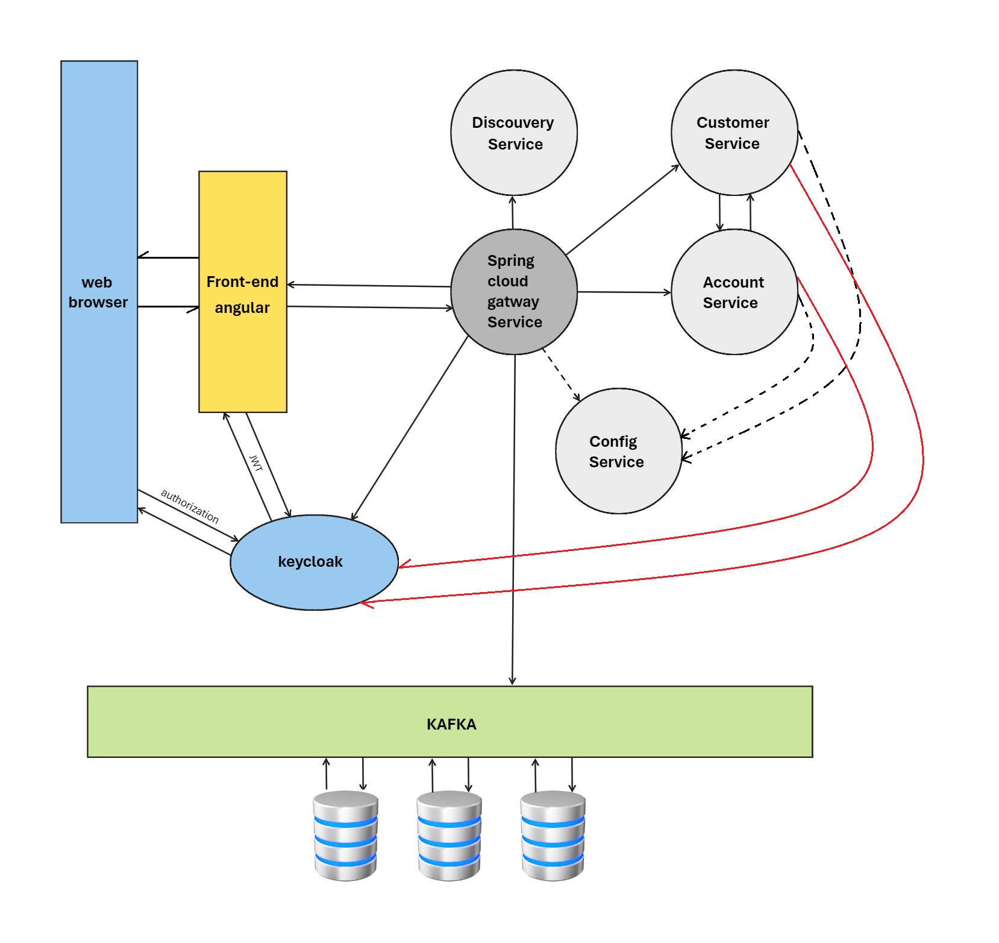

# JEE Exam Correction:

## Partie 1: Questions QCM

1. A,D,E,F
2. C
3. A
4. A,B,D
5. B
6. B
7. B

## Partie 2: Questions Analyse

12. B
13. B
14. A
15. A,C
16. B
17. B
18. D

## Partie 3: Questions Programmation

### 3.1: Partie conception:


1. Architecture technique:




2. Diagramme de classe:


### 3.1: Partie implémentation:

#### Partie 1: Micro-service Customer-Service

a. Code des entités JPA Account et Transaction : 

```java

@Entity @Data @NoArgsConstructor @AllArgsConstructor @Builder @ToString
public class Account {
    @Id
    @GeneratedValue(strategy = GenerationType.AUTO)
    private Long id;
    private Date creationDate;
    private double Solde;
    @Enumerated(EnumType.STRING)
    private Status status;
    @Enumerated(EnumType.STRING)
    private CtType type;

    @OneToMany(mappedBy = "account")
    private List<Transaction> transactions;

    @ManyToOne
    private Client client;
}

@Entity @Data @NoArgsConstructor @AllArgsConstructor @Builder @ToString
public class Transaction {
    @Id 
    @GeneratedValue(strategy = GenerationType.AUTO)
    private Long id;
    private Date dateTransaction;
    private double montant;
    @Enumerated(EnumType.STRING)
    private Type type;

    @ManyToOne
    private Account account;

}
```

b. Code des interfaces JPA Repository basées sur Spring Data des deux entités

```java
public interface AccountRepository extends JpaRepository<Account, Long> {
    List<Account> findByClient(Client client);
}

public interface TransactionRepository extends JpaRepository<Transaction, Long> {
    List<Transaction> findByAccount(Account account);
}
```

c. Code de l’interface AccountService qui déclare deux opérations : 

- une opération qui permet de consulter un compte sachant son id 
- une opération qui permet de débiter un compte d’un montant (retirer un montant d’un compte)


```java

public interface AccountService {
    Account consulterCompte(Long id);
    void retirer(Long id, double montant);
}

```

d. Code de l’interface OpenFeign CustomerRestClient qui permet de consulter un Client en faisant appel au micro-service Customer-Service

```java
@FeignClient(name = "CUSTOMER-SERVICE")
public interface CustomerRestClient {
    @GetMapping(path = "/clients/{id}")
    Client getCustomerById(@PathVariable(name = "id") Long id);
}
```


e. Code d’une implémentation de l’interface AccountService

```java

@Service
public class AccountServiceImpl implements AccountService {

    @Autowired
    private AccountRepository accountRepository;
    
    @Autowired
    private TransactionRepository transactionRepository;
    
    @Autowired
    private CustomerRestClient customerRestClient;

    @Override
    public Account consulterCompte(Long id) {
        Account account = accountRepository.findById(id).get();
        account.setClient(customerRestClient.getCustomerById(account.getClientID()));
        return account;
    }

    @Override
    public void retirer(Long id, double montant) {
        Account account = accountRepository.findById(id).get();
        account.setSolde(account.getSolde()-montant);
        accountRepository.save(account);
        Transaction transaction = new Transaction();
        transaction.setMontant(montant);
        transaction.setAccount(account);
        transactionRepository.save(transaction);
    }
}
```


f. Code d’un RestController pour ce micro-service

```java

@RestController
public class AccountRestController {
    @Autowired
    private AccountService accountService;

    @Autowired
    private AccountRepository accountRepository;


    @GetMapping(path = "/comptes")
    public List<Account> getAccounts() {
        return accountRepository.findAll();
    }

    @GetMapping(path = "/comptes/{id}")
    public Account getAccount(@PathVariable(name = "id") Long id) {
        return accountService.consulterCompte(id);
    }

    @PutMapping(path = "/comptes/retirer/{id}/{montant}")
    public void retirer(@PathVariable(name = "id") Long id, @PathVariable double montant) {
        accountService.retirer(id, montant);
    }


    @DeleteMapping(path = "/comptes/{id}")
    public void deleteAccount(@PathVariable(name = "id") Long id) {
        accountRepository.deleteById(id);
    }

    @PutMapping(path = "/comptes/{id}")
    public Account updateAccount(@PathVariable(name = "id") Long id, @RequestBody Account account) {
        account.setId(id);
        return accountRepository.save(account);
    }

    @PostMapping(path = "/comptes")
    public Account save(@RequestBody Account account) {
        return accountRepository.save(account);
    }

}
```


#### Partie 1: KAFKA et Spring cloud Streams


a. Écrire le code d’un Producer KAFKA qui permet de produire aléatoirement
des transactions et de les publier dans un topic KAFKA

```java

@Component
public class TransactionProducer {
    @Autowired
    private KafkaTemplate<String, Transaction> kafkaTemplate;

    public void send(Transaction transaction) {
        kafkaTemplate.send("TXN_TOPIC", transaction);
    }
}
```


b. Écrire le code d’un Consumer KAFKA qui consomme les transactions publiées
dans le topic KAFKA et de les enregistrer dans la base de données.

```java

@Component
@EnableBinding(Processor.class)
public class TransactionConsumer {

    @Autowired
    private TransactionRepository transactionRepository;

    @StreamListener(target = Processor.INPUT)
    public void onNewTransaction(@Payload Transaction transaction) {
        transactionRepository.save(transaction);
    }
}
```
c. En utilisant KAFKA Streams, écrire le code d’un consumer KAFKA qui permet
de faire du Real Time Stream Processing Data Analytics en consommant le
stream des transactions du topic KAFKA en calculant le somme des
montants des transactions de chaque compte.


```java

@Component
public class TransactionAnalytics {

    @StreamListener("input")
    @SendTo("output")
    public KStream<String, Double> process(KStream<String, Transaction> input) {
        return input
                .map((k, v) -> new KeyValue<>(v.getAccount().getId(), v.getMontant()))
                .groupByKey()
                .reduce(Double::sum)
                .toStream();
    }
}
```

