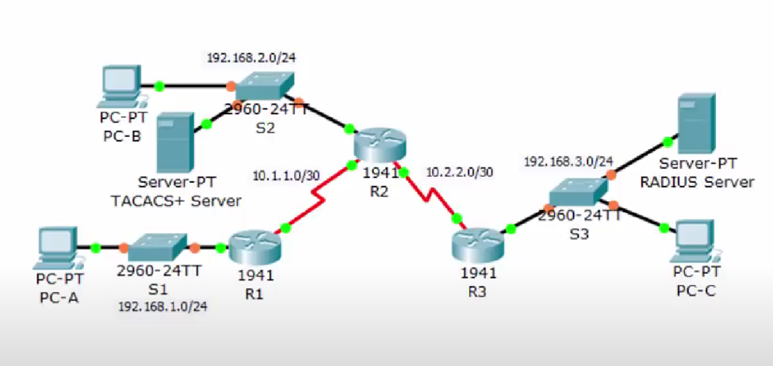
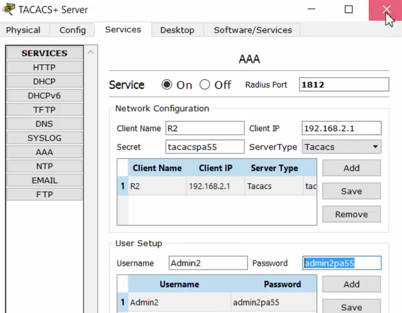
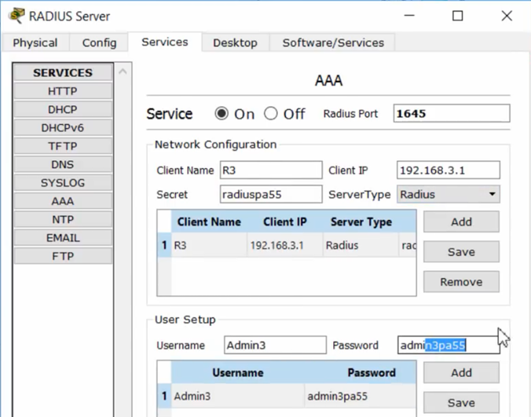

# Security Exam Prep:

## Attacks :
- Force brute : Une attaque visant à deviner un mot de passe en essayant toutes les combinaisons possibles.

- Dictionnaire : Une attaque visant à deviner un mot de passe en utilisant une liste de mots courants.

- Ver : Un programme malveillant qui se propage automatiquement d'un ordinateur à un autre en utilisant un réseau.

- Phishing : Une attaque visant à tromper les utilisateurs en leur faisant croire qu'ils communiquent avec une entité de confiance.

- Man-in-the-middle : Une attaque visant à intercepter les communications entre deux parties.

- Denial of Service : Une attaque visant à rendre un système indisponible pour ses utilisateurs légitimes.

- Buffer overflow : Une attaque visant à exploiter une vulnérabilité de programmation qui permet à un attaquant d'exécuter du code malveillant.

- Ransomware : Un programme malveillant qui chiffre les données d'un utilisateur et demande une rançon pour les déchiffrer.

- Virus : Un programme malveillant qui s'attache des fichiers exécutables et se propage lors de leur exécution.

- Trojan : Un programme malveillant qui se fait passer pour un programme légitime et qui exécute des actions malveillantes telles que l-ouverture d'une porte dérobée.

- Bombe logique : Un programme malveillant qui exécute des actions malveillantes lorsqu'une condition est remplie.

- Backdoor : Moyen d'accès non autorisé à un système informatique, créé intentionnellement par un attaquant.

- spyware : Un programme malveillant qui surveille les activités d'un utilisateur et envoie les informations à un attaquant.

- Honeypots: Un système informatique qui est intentionnellement vulnérable pour attirer les attaquants et les étudier.

- canular electronique : Un moyen electronique qui vise à tromper les utilisateurs en leur faisant croire qu'ils communiquent avec une entité de confiance... "courriels frauduleux, des messages texte, des appels téléphoniques, des sites web frauduleux"

## les objectifs de la sécurité informatique :

- Confidentialité : Empêcher les personnes non autorisées d'accéder aux données.
    - ex : Chiffrement des données 

- Intégrité : Empêcher les personnes non autorisées de modifier les données.
    - ex : hashage des données 


- Disponibilité : Empêcher les personnes non autorisées d'empêcher les utilisateurs légitimes d'accéder aux données.
    - ex : sauvegarde des données , redondance des serveurs


- Authenticité : La vérification de l'identité d'une entité, comme un utilisateur, un système ou une transaction. L'authenticité garantit que l'entité est réellement ce qu'elle prétend être
(identification + authentification)
    - ex : authentification à deux facteurs


## les principes de la sécurité informatique :

- Moins de privilèges : Les utilisateurs ne devraient avoir que les privilèges dont ils ont besoin pour effectuer leur travail.

- Séparation des privilèges : Les utilisateurs devraient avoir besoin de plusieurs privilèges pour effectuer une tâche.


## les fonctions de la sécurité informatique :

- non répudiation : Empêcher les utilisateurs de nier leurs actions.

- contrôle d'accès : Empêcher les utilisateurs non autorisés d'accéder aux données.

- authentification : Vérifier l'identité d'une entité, comme un utilisateur, un système ou une transaction.

- integrity : Empêcher les utilisateurs non autorisés de modifier les données.


### outils de pentest :

- IDS : L’ensemble des outils qui peut identifier le trafic malveillant en comparant le contenu de paquets à des signatures d'attaque connues (Intrusion Detection System). Un IDS surveille le trafic réseau à la recherche de comportements ou de signatures spécifiques associés à des attaques connues
    - ex : Snort
    - detection only


- IPS : l'ensemble des systemes sert a la détection d'intrusion en prenant des mesures actives pour prévenir les attaques. Il peut automatiquement bloquer ou corriger les activités suspectes en utilisant des mécanismes tels que la modification des règles de pare-feu, la mise en liste noire d'adresses IP, ou même la réinitialisation de connexions. L'IPS offre une couche de protection supplémentaire en agissant proactivement contre les menaces détectées.
    - ex : Bro
    - detection + prevention

- Nmap: (Network Mapper) un outil utilisé pour fournir une liste des ports ouverts sur des périphériques réseau est Nmap. Nmap, ou Network Mapper, est un scanner de ports réseau qui peut être utilisé pour découvrir les services en cours d'exécution sur un réseau
    - nmap scan when lunched 

- Zenmap: une interface graphique pour Nmap. Il est utilisé pour visualiser les résultats de Nmap et pour lancer des scans Nmap.


- NetFlow : NetFlow est un protocole de surveillance du réseau développé par Cisco. Il permet de collecter des informations sur le trafic réseau en fournissant des données sur les flux de communication, tels que les adresses IP source et destination, les ports, la durée des sessions, et la quantité de données transférées.
    - netflow keep track of the traffic and save logs

- Tracert : est une commande qui permet de suivre l'itinéraire qu'un paquet prend à travers un réseau pour atteindre sa destination. Il affiche la liste des routeurs traversés par le paquet et le temps de transit à chaque saut

- SIEM : (Security Information and Event Management) is a solution that combine SIM and SEM to provide a comprehensive approach to managing security information. SIM handles the historical and organizational aspects, while SEM focuses on the immediate detection and response to security events, creating a robust system for maintaining the security of an organization's digital environment.
    - ex : Wazuh

- WHOIS : est un service de recherche d'informations sur les noms de domaine et les adresses IP. Il permet d'obtenir des détails sur la propriété d'un domaine, tels que le propriétaire, les contacts administratifs et techniques, les serveurs de noms, etc.


## VPN Configuration :

- This command enables the security features on the Cisco 1900 series router by activating the securityk9 technology package.

```bash
R1(config)# license boot module c1900 technology-package securityk9
```


----------------------------------------------

- This command creates an access control list (ACL) with number 110, allowing IP traffic from the source network 192.168.1.0/24 to the destination network 192.168.3.0/24.

```bash
R1(config)# access-list 110 permit ip 192.168.1.0 0.0.0.255 192.168.3.0 0.0.0.255
```


----------------------------------------------

- This command creates an Internet Security Association and Key Management Protocol (ISAKMP) policy with the priority of 10.

```bash
R1(config)# crypto isakmp policy 10
```


----------------------------------------------

- This command configures AES 256-bit encryption algorithm for securing the VPN traffic.


```bash
R1(config-isakmp)# encryption aes 256
```

----------------------------------------------

- This command specifies that pre-shared keys will be used for authentication during the ISAKMP negotiation.

```bash
R1(config-isakmp)# authentication pre-share
```


----------------------------------------------

- This command sets the Diffie-Hellman group 5 for the ISAKMP key exchange.


```bash
R1(config-isakmp)# group 5
```

----------------------------------------------
- This command exits the ISAKMP configuration mode and goes back to the global configuration mode.


```bash
R1(config-isakmp)# exit
```

----------------------------------------------

- This command sets the pre-shared key "vpnpa55" for the remote VPN peer with the IP address 10.2.2.2.

```bash
R1(config)# crypto isakmp key vpnpa55 address 10.2.2.2
```

----------------------------------------------

- This command creates an IPSec transform set named "VPN-SET" with ESP (Encapsulating Security Payload) using AES encryption and SHA-based HMAC (Hash-based Message Authentication Code) for integrity protection.


```bash

R1(config)# crypto ipsec transform-set VPN-SET esp-aes esp-sha-hmac
```

----------------------------------------------

- This command creates a crypto map named "VPN-MAP" with sequence number 10 for IPSec and ISAKMP (IKE) policies.

```bash
R1(config)# crypto map VPN-MAP 10 ipsec-isakmp
```


----------------------------------------------

- This command adds a description to the crypto map, specifying that it is used for the VPN connection to R3.


```bash
R1(config-crypto-map)# description VPN connection to R3
```

----------------------------------------------


- This command configures the remote VPN peer's IP address as 10.2.2.2.

```bash
R1(config-crypto-map)# set peer 10.2.2.2
```


----------------------------------------------

- This command associates the previously defined transform set "VPN-SET" with the crypto map.


```bash
R1(config-crypto-map)# set transform-set VPN-SET
```


----------------------------------------------

- This command associates the ACL 110 with the crypto map, specifying that traffic matching the ACL should be encrypted.

```bash
R1(config-crypto-map)# match address 110
```


----------------------------------------------

- This command exits the crypto map configuration mode and goes back to the global configuration mode.


```bash
R1(config-crypto-map)# exit
```


----------------------------------------------

- This command enters the configuration mode for the serial interface s0/0/0.

```bash
R1(config)# interface s0/0/0
```


----------------------------------------------

- This command applies the crypto map "VPN-MAP" to the interface s0/0/0, enabling VPN encryption for traffic going through - This interface.

```bash
R1(config-if)# crypto map VPN-MAP
```


----------------------------------------------
----------------------------------------------
----------------------------------------------

## Firewall Configuration :

- Accessing the default/already existing VLAN interface number 1 
```bash
CCNAS-ASA(config)# interface vlan 1
```

----------------------------------------------


- Giving the VLAN interface the name "inside" 
```bash
CCNAS-ASA(config-if)# nameif inside
```

----------------------------------------------

- Setting the interface the ip address 192.168.1.1 and the subnetmask 255.255.255.0
```bash
CCNAS-ASA(config-if)# ip address 192.168.1.1 255.255.255.0
```

 ----------------------------------------------

- In the ASA Firewall device, Security levels are numbered from 0(lowest) to 100(highest) levels

```bash
CCNAS-ASA(config-if)# security-level 100

```

----------------------------------------------

- Accessing the interface of VLAN number 2 (custom) 

```bash
CCNAS-ASA(config-if)# interface vlan 2
```

----------------------------------------------

- Giving the VLAN interface the name "outside" 

```bash
CCNAS-ASA(config-if)# nameif outside
```
----------------------------------------------

- Setting the interface the ip address 209.165.200.226 and the subnetmask 255.255.255.248 

```bash
CCNAS-ASA(config-if)# ip address 209.165.200.226 255.255.255.248
```


----------------------------------------------


- Security level is set to 0

```bash
CCNAS-ASA(config-if)# security-level 0
```
----------------------------------------------

- Default route for any traffic going out of the "outside" interface.
```bash
CCNAS-ASA(config)# route outside 0.0.0.0 0.0.0.0 209.165.200.225
```

----------------------------------------------

- Creating an object network called "inside-net", object network can be known as a grouping of IP Addresses with their subnet masks
```bash
CCNAS-ASA(config)# object network inside-net

```
----------------------------------------------

- Specifying the subnet for the object "inside-net"
```bash
CCNAS-ASA(config-network-object)# subnet 192.168.1.0 255.255.255.0
```

----------------------------------------------

- Configuring NAT (Network Address Translation) using a dynamic NAT for the object, internal ip addresses "inside" are translated to the external "outside" ip address.
```
bash
CCNAS-ASA(config-network-object)# nat (inside,outside) dynamic interface
```


----------------------------------------------

- Exit the Network Object settings and saving them. 

```bash
CCNAS-ASA(config-network-object)# end
```


----------------------------------------------

- Creating a class map called "inspection_default", its uses are to analyze and apply security policies to different protocols and applications.

```bash
CCNAS-ASA(config)# class-map inspection_default
```
----------------------------------------------

- Specifying the match criteria for the class map to "default-inspection-traffic" which contains predefined set of protocols and apps available to the cisco ASA Firewall device.

```bash
CCNAS-ASA(config-cmap)# match default-inspection-traffic
```

----------------------------------------------

- Exiting the settings of the class map. 

```bash
CCNAS-ASA(config-cmap)# exit
```
----------------------------------------------

- Creating a policy map called "global_policy" which is used to define the security policies and actions to be applied to the traffic.

```bash
CCNAS-ASA(config)# policy-map global_policy
```
----------------------------------------------

- Creating a class "inspection_default" inside the policy map "global_policy". 

```bash
CCNAS-ASA(config-pmap)# class inspection_default
```
----------------------------------------------

- Enabling the ICMP (Internet Control Message Protocol) inspection for the class "inspection_default". 

```bash
CCNAS-ASA(config-pmap-c)# inspect icmp
```
----------------------------------------------

- Exiting the policy map setting. 

```bash
CCNAS-ASA(config-pmap-c)# exit
```
----------------------------------------------

- Applying the policy map "global_policy" to the ASA's interface. 

```bash
CCNAS-ASA(config)# service-policy global_policy global
```

----------------------------------------------

- Configuring the DHCP range on the "inside" interface.

```bash
CCNAS-ASA(config)# dhcpd address 192.168.1.5-192.168.1.36 inside
```
----------------------------------------------

- Configuring the DNS Ip address on the "inside" interface. 

```bash
CCNAS-ASA(config)# dhcpd dns 209.165.201.2 interface inside
```
----------------------------------------------

- Enabling the DHCP functionnalities on the "inside" interface.

```bash
CCNAS-ASA(config)# dhcpd enable inside
```
----------------------------------------------

- Creating a user called "admin" with the password "adminpa55".

```bash
 CCNAS-ASA(config)# username admin password adminpa55
```
----------------------------------------------

- Configuring the AAA(Authentication, Authorization, and Accounting) for SSH and console on the ASA firwall device.

```bash
CCNAS-ASA(config)# aaa authentication ssh console LOCAL 
```

----------------------------------------------

- Generating an RSA key with a modulus size of 1024bits. 

```bash
CCNAS-ASA(config)# crypto key generate rsa modulus 1024
```
----------------------------------------------

- Configuring the SSH access on the "inside" interface 

```bash
CCNAS-ASA(config)# ssh 192.168.1.0 255.255.255.0 inside 
```

----------------------------------------------

- Configuring the SSH access on the "outside" interface 

```bash
CCNAS-ASA(config)# ssh 172.16.3.3 255.255.255.255 outside
```

----------------------------------------------

- Setting the SSH timeout value to 10 minutes. 

```bash
CCNAS-ASA(config)# ssh timeout 10

```
----------------------------------------------

- Initiating an SSH connection as user "admin". 

```bash
PC> ssh -l admin 209.165.200.226
```
- Initiating an SSH connection as user "admin". 

```bash
PC> ssh -l admin 192.168.1.1
```
----------------------------------------------

- Accessing the interface of the VLAN number 3 

```bash
CCNAS-ASA(config)# interface vlan 3
```
----------------------------------------------

- Setting the Ip Address and the subnet mask for the interface.

```bash
CCNAS-ASA(config-if)# ip address 192.168.2.1 255.255.255.0  
```

----------------------------------------------

- Disabling the forwarding from/to the vlan 1 to/from the current interface 3 

```bash
CCNAS-ASA(config-if)# no forward interface vlan 1
```

----------------------------------------------

- Naming the interface "dmz", DMZ stands for "demilitarized zone", it adds an extra layer of protection. 

```bash
CCNAS-ASA(config-if)# nameif dmz
```

INFO: Security level for "dmz" set to 0 by default.

----------------------------------------------

- Setting the security level to 70 (min: 0, max: 100) 

```bash	
CCNAS-ASA(config-if)# security-level 70
```

----------------------------------------------

- Accessing the interface "Ethernet0/2"

```bash
CCNAS-ASA(config-if)# interface Ethernet0/2

```

----------------------------------------------

- Associating the vlan 3 to the interface "Ethernet0/2" 

```bash
CCNAS-ASA(config-if)# switchport access vlan 3
```
----------------------------------------------

- Creating the network object "dmz-server" 

```bash
CCNAS-ASA(config)# object network dmz-server
```

----------------------------------------------
----------------------------------------------
----------------------------------------------


## AAA Configuration :




# Main objectives of this TP (divided onto 4 parts):
## Part 1: Configure Local AAA Authentication for Console Access on R1
### Step 1: Test connectivity.
- Ping from PC-A to PC-B.
	PC-A>ping 192.168.2.3
- Ping from PC-A to PC-C.
PC-A>ping 192.168.3.3
- Ping from PC-B to PC-C.
PC-B>ping 192.168.3.3


### Step 2: Configure a local username on R1.
- Configure a username of Admin1 with a secret password of admin1pa55.
R1(config)#username Admin1 secret admin1pa55

### Step 3: Configure local AAA authentication for console access on R1.
- Enable AAA on R1 and configure AAA authentication for the console login to use the local database.

```bash	
R1(config)#aaa new-model
R1(config)#aaa authentication login default local

R1(config)#line console 0
R1(config)#login authentication default
```


### Step 4: Configure the line console to use the defined AAA authentication method.

## Part 2: Configure Local AAA Authentication for vty Lines on R1

### Step 1: Configure domain name and crypto key for use with SSH.
a.	Use ccnasecurity.com as the domain name on R1.
R1(config)#ip domaine-name ccnasecurity.com

b.	Create an RSA crypto key using 1024 bits.
R1(config)#crypto key generate rsa

```text
it will then ask “how many bits in the modulus”, default answer is 512 but we type 1024.
```

### Step 2: Configure a named list AAA authentication method for the vty lines on R1.
- Configure a named list called SSH-LOGIN to authenticate logins using local AAA.

```bash
R1(config)#aaa authentication login SSH-LOGIN local
```

### Step 3: Configure the vty lines to use the defined AAA authentication method.

- Configure the vty lines to use the named AAA method and only allow SSH for remote access.
```bash	
R1(config)#line vty 0 4
R1(config-line)#transport input ssh
R1(config-line)#login authentication SSH-LOGIN
```
### Step 4: Verify the AAA authentication method.
- Verify the SSH configuration SSH to R1 from the command prompt of PC-A..

```bash
PC-A> ssh -l Admin1 192.168.1.1
```

- After entering the command and successfully entering the password, we will be able to get into the router R1’s command prompt with the authentication using a local database, now it’s time to try it using the other method: Server based authentication (TACACS)

## Part 3: Configure Server-Based AAA Authentication Using TACACS+ on R2

### Step 1: Configure a backup local database entry called Admin.
- For backup purposes, configure a local username of Admin2 and a secret password of admin2pa55.

```bash
R2(config)#username Admin2 secret admin2pa55
```

### Step 2: Verify the TACACS+ Server configuration.





### Step 3: Configure the TACACS+ server specifics on R2.
- first, we define the TACACS’ IP address:

```bash
R2(config)# tacacs-server host 192.168.2.2
```

- then we define the key to establish the connection between the server and routers:

```bash
R2(config)# tacacs-server key tacacspa55
```

### Step 4: Configure AAA login authentication for console access on R2.
- Enable AAA on R2 and configure all logins to authenticate using the AAA TACACS+ server.
    
    ```bash
R2(config)#aaa new-model
R2(config)#aaa authentication login default group tacacs+ local
    ```
### Step 5: Configure the line console to use the defined AAA authentication method.
- Configure AAA authentication for console login to use the default AAA authentication method.
R2(config)#line console 0
R2(config-line)#login authentication default
Part 4: Configure Server-Based AAA Authentication Using RADIUS on R3
- For this section, we’ll be using the RADIUS server instead of the TACACS we used earlier.
Step 1: Configure a backup local database entry called Admin3.
R3(config)#username Admin2 secret admin2pa55
Step 2: Verify the RADIUS Server configuration.




- Difference between TACACS and RADIUS, RADIUS uses plain text, and TACACS is more secure by encrypting the information

### Step 3: Configure the RADIUS server specifics on R3.
- First, we define the RADIUS IP address:

```bash
R3(config)# radius-server host 192.168.3.2  
```

- then we define the key to establish the connection between the server and routers:

```bash
R3(config)# radius-server key radiuspa55
```

### Step 4: Configure AAA login authentication for console access on R3.
- Enable AAA on R3 and configure all logins to authenticate using the AAA RADIUS server.

```bash
R3(config)#aaa new-model
R3(config)#aaa authentication login default group radius local
```

### Step 5: Configure the line console to use the defined AAA authentication method.

```bash
R3(config)#line console 0
R3(config-line)#login authentication default
```


----------------------------------------------
----------------------------------------------
----------------------------------------------

